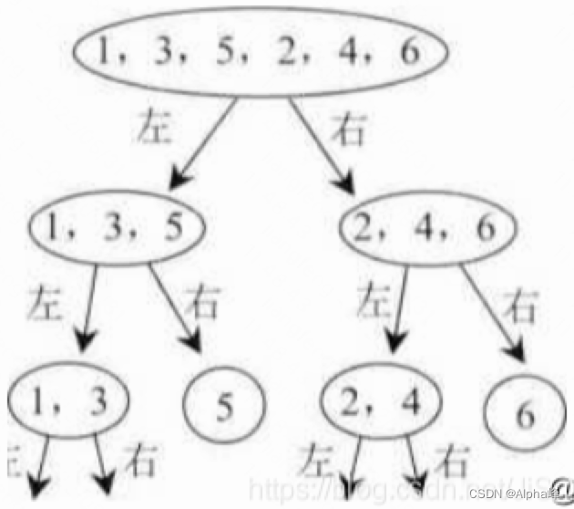
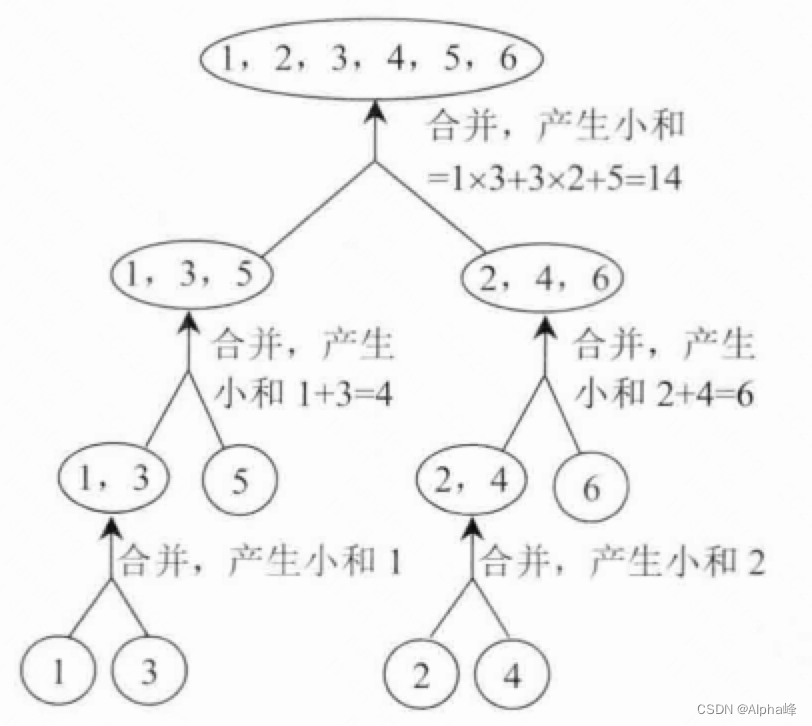

# 1.问题描述

数组小和的定义如下：

例如，数组s=[ 1,3,5,2,4,6],在s[0]的左边小于或等于s[0]的数的和为0,在s[l]的左边 小于或等于s[l]的数的和为1, 在s[2]的左边小于或等于s[2]的数的和为1+3=4, 在s[3]的 左边小于或等于s[3]
的数的和为1, 在s[4]的左边小于或等于s[4]的数的和为1+3+2=6, 在 s[5]的左边小于或等于s[5]的数的和为1+3+5+2+4=15,所以s的小和为0+1+4+1+6+15=27。

给定一个数组s,实现函数返回s的小和。

# 2.思路和解法

通常采用暴力破解，时间复杂度是n方，此法过程简单忽略。

可以利用归并排序，一边排序一边计算小和，排序后的两组元素再进行归并的时候计算小和的时间复杂度是n+m，小于n*m 。

图一

具体过程：

1. 先分组拆成一个一个的元素：见
2. 再归并，并且归并的同时计算这两个元素产生的小和，计算完小和之后两个元素就可以进行排序而不影响结果。
3. 当任意一组多于两个元素时，假设A组n个元素，B组m个元素，维护两个指针i，j。（此两组的组内元素必定是有序的，不理解见：步骤2）
    * 当A[i]<=B[j]时，移动A组指针i，同时求出产生的小和为A[i]*(m-j+1) 因为B[j]后面的元素都更大，不用算了(最关键的一步节省了算力)。
    * 当A[i]>B[j]时，移动B组指针j，不产生小和 由于两组内的元素都是排好序的，所以可以使用两个指针
    * 照例用上面的方式算好小和后进行归并排序。即：维护一个临时数组，1.哪边组元素小
      将那一边元素放入零时数组，2.然后将没放完的那组剩下元素都放入零时数组。3.最后将临时数组中有序的元素的回赋给这个区间，（这样下一步中，用到的每组组内都是有序的）

上述见图：

图二

把每一步合并产生的小和加起来即组小和。

# 3.代码：

```java
class GroupSmallSum {

    public static int smallSum(int[] a, int start, int end) {
        if (start < 0 || start >= end) {
            return 0;
        }
        int mid = (start + end) / 2;
        return smallSum(a, start, mid) + smallSum3(a, mid + 1, end) + merge(a, start, end, mid);
    }

    /**
     * 一边归并一边排序
     */
    public static int merge(int[] a, int start, int end, int mid) {
        int sum = 0;
        int[] tempA = new int[end - start + 1];
        int tempIndex = 0;
        int i = start, j = mid + 1;
        while (i <= mid && j <= end) {
            if (a[i] <= a[j]) {
                sum += a[i] * (end - j + 1);
                tempA[tempIndex++] = a[i++];
            } else {
                tempA[tempIndex++] = a[j++];
            }
        }
        while (i <= mid) {
            tempA[tempIndex++] = a[i++];
        }
        while (j <= end) {
            tempA[tempIndex++] = a[j++];
        }
        //复制tempA 给 原数据
        for (int k = 0; k < tempA.length; k++) {
            a[start + k] = tempA[k];
        }
        return sum;
    }


}
```

# 4.后话性能测试：

```java
 public static void main(String[]args){

        Random random=new Random();

        int[]a=Stream.generate(()->random.nextInt(1000)).limit(100000).mapToInt(i->i).toArray();

        StopWatch stopWatch=new StopWatch();
        // 暴力破解
        stopWatch.start("1");
        smallSum(a);
        stopWatch.stop();


        // 归并排序
        stopWatch.start("3");
        System.out.println("smallSum3");
        smallSum3(a);
        stopWatch.stop();
        System.out.println(stopWatch.prettyPrint());

}
```

输出结果

```
// 一百个元素时
820456
smallSum3
820456
StopWatch '': running time = 574456 ns
---------------------------------------------
ns         %     Task name
---------------------------------------------
000435353  076%  1
000139103  024%  3


// 100000个元素时：

 -95754247
 smallSum3
 -95754247
 
 StopWatch '': running time = 2555184706 ns
   ---------------------------------------
   ns         %     Task name
   ---------------------------------------
 2537280158  099%  1
 017904548  001%  3
 
```

还有一个优化点 可以提前new出一个完整的temp数组，避免来回new。